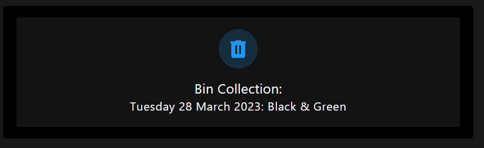

# HA - Stockport Bin Collections

A Home Assistant custom integration for displaying bin collection day and which bins need to go out based on your address. This integration scrapes the data from the Stockport bin collection website every 12 hours and will fetch the next bins to go out.
  

  

## Installation

### HACS (Recommended)

1. Go to the HACS panel in Home Assistant.
2. Click on the three dots in the top right corner and choose "Custom repositories".
3. Enter `b0mbays/ha-stockport-bin-collections` in the "Add custom repository" field, select "Integration" from the "Category" dropdown, and click on the "Add" button.
4. Once the custom repository is added, you can install the integration through HACS. You should see "My Bin Collection" in the "Integrations" tab. Click on "Install" to add it to your Home Assistant instance.

### Manual

1. Clone this repository to your local machine.
2. Copy the `custom_components/ha-stockport-bin-collections` directory to the `custom_components` directory in your Home Assistant configuration.

## Configuration

1. In your Home Assistant instance, go to Configuration > Integrations > Add Integration.
2. Search for "Stockport Bin Collections" and click on it.
3. Enter your unique number (the numbers at the end of your bin collection URL, find your address here: https://myaccount.stockport.gov.uk/address-finder/bin-collection and grab the unique numbers at the end of the URL) and click "Submit".

After setting up the integration, a new sensor named `sensor.bin_collection` will be created. You can add this sensor to a Lovelace dashboard to display the bin collection information.

## Support

If you encounter any issues or have questions, please [open an issue](https://github.com/b0mbays/ha-stockport-bin-collections/issues) on GitHub.

## License

This project is licensed under the MIT License. See the [LICENSE](LICENSE) file for details.
